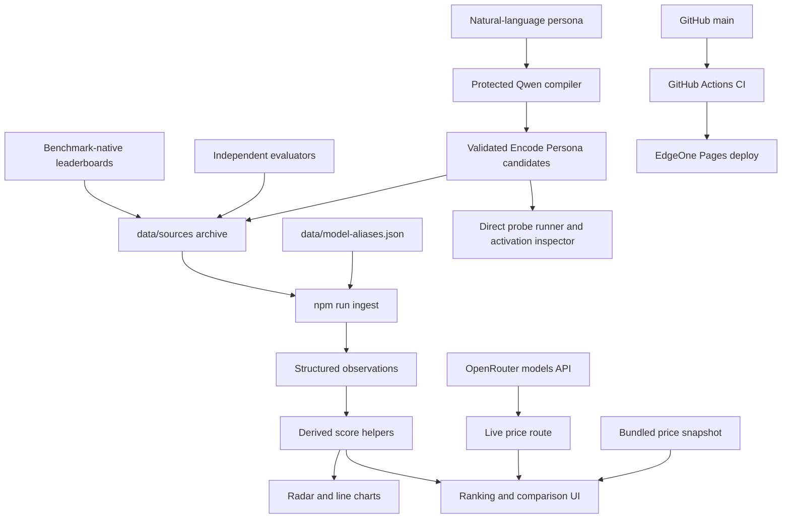
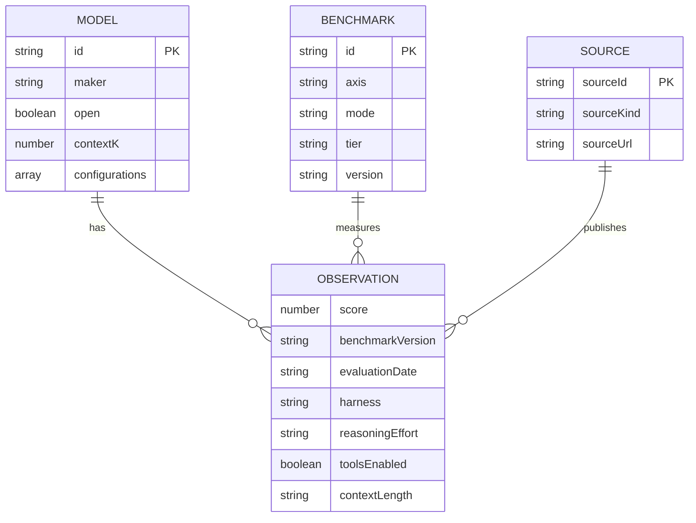
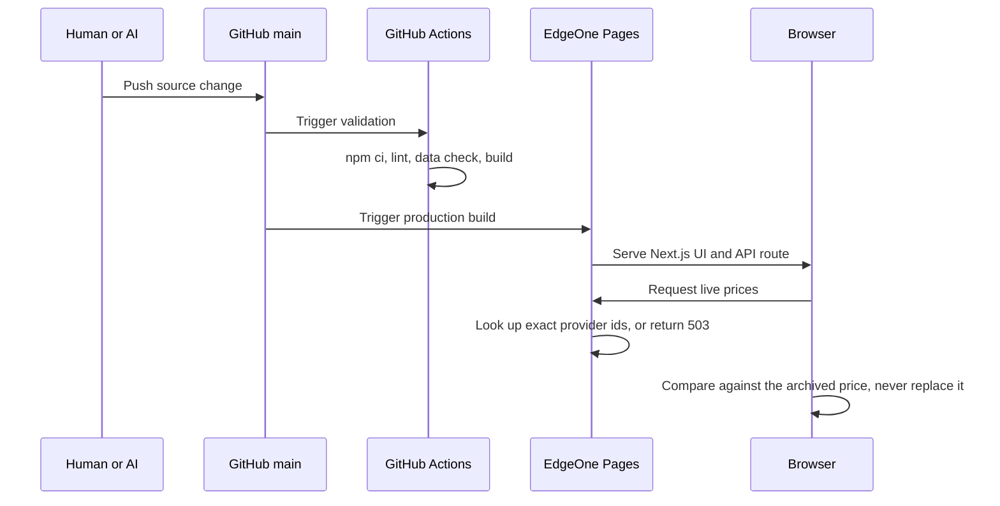

# AI Model Observatory Architecture

This document is the operational handoff for humans and coding agents. Read it before changing the data model, ranking semantics, deployment path, or UI structure.

## 1. System overview



The application has three independent data paths:

1. Versioned benchmark evidence, generated from the `data/sources/` archive into
   `app/observations.generated.ts` and combined with the seed rows in `app/model-data.ts`.
2. A live price **comparison** through `app/api/live-models/route.ts`. It does not write into
   the catalog. The card shows the archived list price, and the provider's current figure
   appears beside it only where the two disagree — a disagreement is a collection signal, not
   a number to display. See §6.
3. A protected Persona Lab path through `app/api/persona/`: Qwen produces multiple candidate
   encodings, deterministic grammar validation gates experiments, and a selected encoding is
   sent unchanged with each probe. The server returns exact prompt provenance, observable
   `reasoning_content`, final content, usage, and heuristic PAL/MRR/ICRR/DPE. Browser-local history
   is convenience storage, not the observatory archive or the full SQLite/JSONL research harness.

Current scale: **29 model families, 72 benchmarks, 1773 observations across 1090 of 2088 cells**,
sourced benchmark-native 880 / independent 703 / vendor 190. **318 of 321 catalog numbers are
backed by an archive row**; the three that are not are listed by `npm run check:models` on every
run rather than hidden.

## 2. Repository map

| Path | Responsibility |
| --- | --- |
| `app/model-data.ts` | Model metadata, benchmark taxonomy, observations, derived scores, source cards |
| `app/models/page.tsx` | The observatory itself: client state, rankings, coverage, radar, line charts, tables, language switching |
| `app/models/layout.tsx` | Its title — the page is a client component and cannot export metadata |
| `app/page.tsx` + `app/home-content.ts` + `app/home.module.css` | The owner's personal site at `/`. Reads no data file; see AGENTS.md "Three product surfaces share this repo" |
| `app/persona/` | Persona Lab at `/persona`: client workbench, protocol types, candidate validation, activation segmentation, and scoped styles |
| `app/api/persona/` | Fail-closed Qwen compile/run/status routes. Server-side `QWEN_API_KEY`; separate `PERSONA_ACCESS_TOKEN`; no persistent server storage |
| `app/layout.tsx` | Root layout: the one mono webfont, the viewport contract, and the ICP strip on every route |
| `app/site-beian.tsx` + `app/site-beian.module.css` | The ICP filing footer. Belongs to neither site — see §6, and do not move it into a page |
| `app/api/live-models/route.ts` | OpenRouter price/context lookup, short-lived cache, and the folded "new upstream" note |
| `app/upstream-variants.ts` | The one home for "what upstream serves that is not a model" — imported by that route and by two scripts |
| `app/globals.css` | Light visual system and responsive layout |
| `data/deployment.json` | Where production is, so `check:deployment` can ask whether it serves what `main` says |
| `scripts/check-deployment.mjs` | Compares the live bundle against the catalog — catches a stalled or partial deploy |
| `data/sources/*.jsonl` | Append-only raw transcription archive, one row per published result |
| `data/model-aliases.json` | Every editorial decision: model mapping, benchmark splits, version and source-class overrides |
| `scripts/ingest.mjs` | Archive + aliases → `app/observations.generated.ts` |
| `scripts/lib/archive.mjs` | Alias resolution and archive reading, shared by ingestion and the gap report |
| `scripts/report-gaps.mjs` | What has *not* been collected: cells below a floor, unaliased rows, new upstream models |
| `scripts/publish-gaps-issue.sh` | Publishes that report to one self-updating GitHub issue |
| `docs/INGEST-PROMPT.md` | The transcription contract given to a browsing model |
| `docs/UI.md` | Type scale, breakpoints, the phone contract, and how to verify a layout change |
| `scripts/check-model-data.mjs` | Observation contract enforced in CI |
| `scripts/check-model-provenance.mjs` | Audits every catalog number against the archive |
| `scripts/fetchers/*.mjs` | One module per source this project can re-read by script |
| `scripts/fetch-source.mjs` | Runs them: writes a batch, or `--check` diffs every archive against upstream |
| `scripts/open-refresh-pr.sh` | Turns a moved live board into one self-updating pull request |
| `scripts/check-price-terms.mjs` | Fails when the catalog quotes a promotion recorded in a batch meta |
| `scripts/check-mobile.mjs` | Layout probe: overflow, type floor and tap-target floor under device emulation |
| `.github/workflows/ci.yml` | Lint, data contract, price terms, and production build checks |
| `.github/workflows/upstream.yml` | Daily: re-fetch archived sources for drift, then report what was never collected |
| `README.md` | User-facing overview and deployment instructions |
| `AGENTS.md` | Short coding-agent operating contract |

## 3. Core entities



An observation is the atomic unit. Its conceptual key is:

```text
model × benchmark × benchmark_version × harness × reasoning_effort × tools_enabled × context_length
```

### Model identity

One record per model **family**. Reasoning effort is a property of a run, so it lives on the
observation row and in `ModelRecord.configurations`, never in the model id. An id like
`gpt-5.6-terra-max` cannot receive a leaderboard line that says only `GPT-5.6 Terra` without
someone guessing which effort was meant, and guessing is what this project exists to avoid.

`configurations` is ordered strongest first. The record's top-level `intelligence`, `speed`,
`price` and so on are derived from `configurations[0]` so rankings read one number per model;
the other operating points stay visible in the model dossier. Arena Elo is taken from
whichever configuration carries one, because Arena publishes no per-effort boards.

Arena Elo is the one field on the record that is **generated rather than authored**. It moves
continuously, so a typed value is stale immediately and a daily refresh would fight `check:models`
every morning. `npm run ingest` emits `ARENA_ELO` from the archive's parameter batches and the
record reads it, which leaves the archive as the only place the number lives and leaves the audit
with nothing to disagree with. The pick is per field and follows the audit's own precedence — the
flagship's operating point, then a row published with no operating point, then anything. That
middle rung is load-bearing: a bare `gpt-5.5` row is the board's model-level statement (1476) and
outranks a `gpt-5.5-high` row (1482) that merely appears earlier in the file.

### Ingestion pipeline

```text
data/sources/*.jsonl        raw transcription, never edited to fit the catalog
  + *.meta.json             retrieval date, and whether the batch was filtered at capture
  + data/model-aliases.json every editorial call, reviewable on its own
        │  npm run ingest
        ▼
app/observations.generated.ts    generated, do not hand-edit
        │
        ▼
OBSERVATION_ROWS in app/model-data.ts
```

The split matters: the archive is evidence and the alias file is judgement. A row with no
alias entry is **skipped and reported**, never guessed into place, and it stays in the
archive so it can be ingested later when the catalog gains that model. `npm run ingest`
prints every skipped row, so the cost of a missing catalog entry is always visible.

Resolution is `(model_raw, effort)` and, since 2026-08-05, optionally the batch file: an alias may
carry `"file"` and a file-scoped entry beats a global one. It exists because a published string is
not always one model. DeepSeek shipped V4 Flash as a preview and then as the post-trained 0731
release; LiveBench, Epoch and LMArena publish both under `deepseek-v4-flash` and
`deepseek-v4-flash-0731`, while Artificial Analysis kept the bare slug for the *official* model.
One global mapping cannot express that, and the one that existed put the preview's LiveBench
scores in the 0731 record — half the real numbers, on 23 cells, with every check green. Effort
cannot stand in for the scope: on LiveBench neither release carries one. Scope is a last resort;
a string nobody can attribute stays unmapped, which is what rule 8 asks for.

Values in the archive are never altered, but a batch may be **filtered at capture**: batches
02-04 kept the 2026-era frontier rows and dropped the long tail of pre-2026 models the
catalog will not track. Each batch's `.meta.json` records `filtered`, the rule used, and the
source URLs, so a fuller re-transcription can be dropped in later — `npm run ingest` picks
up whatever the files contain, with no code change.

`data/model-aliases.json` carries every kind of judgement the archive itself must not encode,
each with a written reason:

| Key | Decides |
| --- | --- |
| `aliases` | which published model string is which catalog model, at which effort — and, where a string means different models in different sources, in which batch file |
| `benchmarkSplits` | when a published "version" is really a different problem set |
| `versionAliases` | when two sources spell the same version differently |
| `benchmarkAliases` | when an evaluator uses its own name for a benchmark already catalogued |
| `versionFallbacks` | when a source publishes no version label and the catalog owns the column |
| `droppedBenchmarks` | what is deliberately not carried, and why |
| `sourceKindOverrides` | when a page's source class is not what it looks like |
| `supersededRows` | when a later reading replaces an earlier one — a whole batch, one benchmark, or a single field of a single row |

`sourceKindOverrides` is not cosmetic. Epoch AI's FrontierMath page is benchmark-native because
FrontierMath is Epoch's own benchmark; Epoch's GPQA page is an *independent* evaluation,
because GPQA belongs to someone else and Epoch is a third party running it.

`supersededRows` exists because the archive is append-only and a scripted fetch is not a
correction of the transcription it replaces — it is the same measurement, read exactly instead
of by eye. Batch 02 read 18 DeepSWE rows off the screen rounded to whole points; batch 11 reads
all 50 configurations from the artifact the page loads. Ingesting both would put two rows in one
cell and let the rounded reading win the primary slot, because a system benchmark keeps the
highest score within a source class and 74 beats 73.6. So the transcribed rows stay in the
archive as evidence of what the page showed that day, and the alias file records that they are
no longer ingested. `npm run ingest` prints them, like every other skip.

An entry can be scoped four ways, narrowing from a whole batch down to one number:
`file` alone supersedes everything in a batch; `benchmark` and `benchmarkVersion` narrow it to a
column (batch 02 holds Terminal-Bench 2.0 and 2.1 under one name and only 2.1 was rescripted);
`modelRaw` and `field` narrow it to a single value in a single row. The last pair exists because
of Inkling: the Tinker pricing page publishes 256K, which is that product's serving limit, while
the model's own `config.json` publishes 1,048,576. Both are true, both are archived, and neither
should be deleted — the entry only tells the provenance audit which one answers "what is this
model's context window".

### Observation store

`OBSERVATION_ROWS` is the canonical store: a flat list where every entry carries its own
`modelId`, `benchmarkId` and full provenance. Everything else is derived from it.

```text
OBSERVATION_ROWS            all transcribed rows, one per published configuration
  └─ OBSERVATIONS_BY_CELL   grouped by model × benchmark, sorted by source strength
       └─ BENCHMARK_OBSERVATIONS   the primary row of each cell
            └─ BENCHMARK_SCORES    the primary score of each cell
```

A single cell may hold several rows, because these are different results and must not be
merged: Terminal-Bench 2.1 reports Fable 5 at 83.8% under Claude Code and 80.4% under
Terminus 2. Both are stored; the table shows the primary and marks the rest as `+n`.

Primary selection is mechanical, not editorial:

1. Source strength — `benchmark` > `independent` > `vendor`.
2. Within the same class, a **system** benchmark keeps the highest score (best available
   scaffold, which is what a system lens means) and a **model** benchmark keeps the most
   recent evaluation.

Do not create an independent score table or add a number without provenance.

## 4. Source policy

Use the strongest available source for each observation:

1. **Benchmark-native leaderboard** — preferred because its version and harness are controlled by the benchmark owner.
2. **Independent evaluator** — useful for cross-model consistency and professional-work evaluations.
3. **Vendor release material** — valid for filling gaps, but preserve its exact model configuration and harness notes.

The Kimi K3 release table is a useful comparison seed, not the benchmark standard. The same rule applies to every vendor table.

Do not merge values when any of these differ materially:

- DeepSWE v1.0 vs v1.1
- Terminal-Bench 2.0 vs 2.1 (now separate benchmark ids)
- HLE without tools vs with tools
- MRCR 128K average vs 1M pointwise
- Codex vs Claude Code vs Kimi Code vs Terminus vs mini-SWE-agent
- low/high/max reasoning effort

## 5. Capability and ranking semantics

Seven radar axes are defined in `AXES`. An axis is calculated only from available compatible core observations. Missing axes remain absent; they are not zero-filled.

Coverage means evidence completeness, not model quality:

| State | Meaning |
| --- | --- |
| `Not ingested` | No compatible core observation is loaded |
| `Partial` | Some compatible core observations are loaded |
| `Broad` | At least half of compatible core observations are loaded |

Ranking lenses stay separate:

- General capability: independent composite snapshot stored on the model record.
- Coding system: core system-level coding observations, subject to the coverage floor below.
- Agent system: core system-level agent observations, subject to the coverage floor below.
- Human preference: Arena Elo.
- Speed: output tokens per second.
- Value: current capability/cost heuristic.

These lenses answer different questions and must not be silently blended.

### The portfolio coverage floor

A portfolio average compares models only when they were measured on comparable baskets. Averaging
whatever cells happen to exist does not: it rewards thin evidence, because a model measured only
on the generous benchmarks of an axis outscores one measured on all of them.

This was not hypothetical. On the agent lens, `Muse Spark 1.1` ranked first at 81.9 from 2 of 5
agent benchmarks — `mcp-atlas` and `toolathlon`, where every model scores in the 70s and 80s —
while `Claude Fable 5`, measured on all five including `osworld2` where scores collapse, sat
fifth at 75.7. `Inkling Small` ranked second on a single cell.

So `portfolioScore` publishes a number only when the model covers **at least half of that axis's
core benchmarks and at least two of them** (`PORTFOLIO_MIN_RATIO`, `PORTFOLIO_MIN_CELLS`,
`portfolioFloor` in `app/model-data.ts` — the data layer, not the page, because
`npm run report:gaps` reads the same rule to find the models sitting one cell below it).
Below the floor the value is `N/A` and the model leaves that ranking, the same
way a model with no published cost per task is absent from the value lens rather than free. Each
ranking cell and dossier KPI prints its `present/total` count, so the floor is visible rather than
inferred.

The floor applies to the ranking table and the dossier KPIs. The radar still plots every axis it
has evidence for, because it reports one axis at a time next to an explicit coverage figure
rather than collapsing a basket into a rank.

Consequence to keep in mind: with 5 core agent benchmarks the floor needs 3, and the long-context
axis has 2 core benchmarks that no model currently carries together. Adding a benchmark to an axis
raises the bar for every model on it.

## 6. Runtime and deployment



### The live price path is a comparison, not a refresh

Two rules of this project make an overwriting price feed impossible to keep honest. The catalog
quotes **list price, never a promotion** (§10), and every catalog number is **backed by an archive
row** (`npm run check:models`) — a figure that arrives at runtime satisfies neither. The feed used
to write straight into the model record anyway, which meant the dashboard silently published the
Claude Sonnet 5 introductory rate that §10 exists to exclude, and `check:prices` could not see it
because that check runs at build time over batch metadata.

So the archived price is what the card shows. OpenRouter's current figure sits beside it and is
rendered only where the two disagree by more than 0.5%. Today 17 of 27 corroborate the archive
exactly, which is a provenance signal worth having; the other 10 are a collection queue.

Lookups are **exact provider ids**, never substrings. `list.find` returns the first id containing
the needle, and OpenRouter serves overlapping names: the needle `gpt-5.6` matched
`openai/gpt-5.6-luna-pro`, so the GPT-5.6 Sol card rendered $0.10/$0.60 in place of $5/$30. Six
other lookups landed on a `-fast`, `-pro` or `-lite` variant the same way, and none of it was
visible, because a wrong price looks exactly like a right one. A retired id now resolves to
nothing and the card keeps its archived figure, which is the safe direction to fail in;
`npm run report:gaps` reports the dead lookup.

### Two code paths print "served upstream, not in this catalog"

The same sentence is computed twice, from different evidence, and that is deliberate: the route
sees what a provider is serving **right now** (earlier than any scheduled job), while
`npm run report:gaps` sees what the **archive** already holds for each of those names and can
therefore say whether a record today would lower cell coverage. Neither can do the other's job — the
route runs at the edge with no archive.

What they must not do is disagree about *what counts as a model*. They did: the tier and variant
filters were written in `report-gaps.mjs` and again in `aa-new-models.mjs`, and the route — the only
one a reader ever sees — had neither. On 2026-08-10 the daily issue read clean while the site showed
eight names of which five were `(batch)` or `(Fast)` tiers of models already on the board. Worse, the
route's `.slice(0, 8)` came last, so those five tiers were spending five of the eight slots and
`GPT-5.6 Luna Pro`, `Terra Pro` and `Sol Pro` — three real, uncatalogued models — never appeared at
all.

The rule now has one home, `app/upstream-variants.ts`, imported by the route and both scripts. The
route must import it **with the `.ts` extension**: `scripts/report-gaps.mjs` runs `route.ts` through
Node's type stripping, and Node resolving app→app has no bundler to guess the extension.
`tsconfig.json` already sets `allowImportingTsExtensions`. The site's list is folded shut and its
note says outright that it is not a defect list; the cap now reports how many names it cut.

Canonical production settings:

```text
Node.js: 22
Install: npm ci
Build: npm run build
Output: .next
Host: Tencent EdgeOne Pages
Source branch: GitHub main
```

GitHub Pages is intentionally not used because it is static-only and cannot run the current Next.js API route.

EdgeOne builds from `main` independently of GitHub Actions. A failing CI run does not block a
deploy — only a failing `npm run build` does. `check:prices` and `check:upstream` are therefore
notifications rather than gates: they turn CI red while the site keeps serving whatever was last
merged. Read the CI result before merging, not after.

### Domain and ICP filing

The production domain is **`quarkspace.top`**, registered 2026-07-31 through DNSPod, and it is
filed with the MIIT. Two numbers come out of a filing and they are not interchangeable:

| Number | What it is | Where it goes |
| --- | --- | --- |
| `京ICP备2026050077号` | 主体备案号 — the entity | Nowhere on the site |
| `京ICP备2026050077号-1` | 服务备案号 — this one website | **The footer, linked to the registry** |

The site is filed in Beijing, and Tencent Cloud's current rule for a Beijing filing is that the
footer carries the **service** number — the one with the `-1` suffix — as a link to
`https://beian.miit.gov.cn/`. Guangdong filings are the case people quote for hanging the bare
entity number; copying that here fails the check.

Tencent also verifies that **both the filed apex and its `www` host serve the site**, so a
deployment that answers on only one of them is a filing problem even though the pages are fine.

It is implemented as `app/site-beian.tsx` + `app/site-beian.module.css`, rendered once from
`app/layout.tsx` **after `{children}`**, so every route carries it — including a route added later
by someone who never reads this section. That is the whole reason it is not a per-page footer.
It reaches every route that goes **through that layout**; `/deepseek` does not, and the exception
is recorded at the end of this section rather than left for `check:beian` to imply it away.
The strip hardcodes its colours: it renders above both palettes (`--muted`/`--line` from
globals.css, `--h-*` from `home.module.css`), and under `.home` the globals variables are still in
scope, so reading either set would paint it wrong on one of the two sites. Below 800px it clears
the observatory's fixed bottom rail through `:global(.shell) ~ .strip` — `.shell` is a plain global
class, whereas `.home` is a CSS-module class whose emitted name is hashed and cannot be matched
that way (it does not need to be; the personal site has nothing fixed).

There is a **second filing**, and it is a different authority. The ICP filing above is MIIT; the
公安联网备案 is the Ministry of Public Security, filed through `beian.gov.cn` and reviewed by the
district police unit — here 西城驻区大队, submitted 2026-08-10 with a 30-day review window
(so a decision by roughly 2026-09-09; the result arrives by SMS to the number on the filing, which
is deliberately not recorded in this repository). When it is approved the footer takes a **second**
number linked to `https://www.beian.gov.cn/`, alongside the ICP one. `app/site-beian.tsx` is
already the single place that renders it, so that is a one-file change — do not add it to a page.

**Live since 2026-08-10.** Binding the domain took three steps in this order, and the order is the
part worth remembering: EdgeOne first proves ownership through a `TXT` record at
`edgeonereclaim.<domain>`, and only then issues the per-host CNAME targets that actually route
traffic. Ownership verification does not serve a single byte — a domain can pass it and still not
resolve, which is exactly the state this section described for most of that day.

```text
quarkspace.top      CNAME  quarkspace.top.pages.dnsoe6.com
www.quarkspace.top  CNAME  www.quarkspace.top.pages.dnsoe4.com
ai-model-observatory-lhi0hg2y.edgeone.cool   EdgeOne's own default domain, same build
```

Measured once both were bound: all three hosts answer `200` with a clean TLS verify, and the ICP
number renders in the **server-side** HTML of `/`, `/models`, and `/persona` on both custom hosts
matrix, not one spot check. Server-side matters: whoever checks the filing may not run JavaScript.
The apex and `www` each serve independently; neither redirects to the other.

`productionUrl` in `data/deployment.json` is therefore set to the apex, which activates
`check:deployment` — the check that had never once run. It passes: every catalog name is present in
what the live site serves. Note what that check does and does not prove. It compares `main` against
production, so it catches a stalled or partial deploy; it says nothing about whether the filing is
displayed, which is why the 2×2 matrix above was measured by hand rather than added to it.

### `/deepseek` is a static game, not a Next route

`public/deepseek/` holds the build output of a separate project (`strandbound`, a self-contained
HTML5 canvas game) — 13 files, 552KB, copied in whole. It is served as static files, and two
consequences follow from that; both are gotcha **35**.

Next serves `public/` by **exact path** and does not resolve a directory to its `index.html`.
Measured on a local production build: `/deepseek` → 404, `/deepseek/` → 308 into that same 404,
`/deepseek/index.html` → 200. `next.config.ts` therefore redirects `/deepseek` to the file. It
points at the file rather than rewriting the directory because the game's asset paths are all
relative and would resolve one directory up under a bare `/deepseek`, and because a service worker's
scope is its own directory — a page served at `/deepseek` is outside `/deepseek/` and would lose the
offline path. The redirect is 307: the shareable URL is `/deepseek`, and a permanent one would be
cached on every device that ever opened it.

**This route does not carry the ICP filing, by decision** (owner, 2026-08-15 — the game is
fullscreen and installable as a PWA, and a footer strip costs both). The important part is not the
decision but what it does to the checks: `check:beian` reads `.next/server/app/*.html`, a static
route never appears there, and the check reports "3 route(s) × 1 filing(s)" green while the host
serves a fourth. Reversing the decision is one file: add a small filing link to
`public/deepseek/index.html` and assert that file in `check:beian` too, reading the number from
`app/beian-filing.ts` so a second copy cannot drift.

## 7. Change playbooks

### Add a model

1. Collect its operating parameters into a `data/sources/batch-NN-*.jsonl` with a
   `.meta.json` whose `schema` starts with `Model operating parameters`. That prefix is what
   keeps the batch out of the observation store and inside the provenance audit.
2. Add the published model strings to `data/model-aliases.json`. One family id, `effort: "*"`.
3. Add one `ModelRecord` to `MODELS` with a family-level id — never an effort in the id — and
   one `cfg(...)` per published operating point, strongest first.
4. Add provider lookup aliases to `app/api/live-models/route.ts` when live pricing exists.
5. `npm run ingest` — archived observations for that model attach themselves.
6. `npm run check:models` must pass; anything it calls unsourced needs a source or stays null.
7. Let unavailable data remain absent. A model with no published cost per task drops out of
   the value lens; it is not free.

### Add a benchmark

1. Add one `BenchmarkRecord` with axis, mode, tier, method, version and canonical URL.
2. Decide `core` / `observe` / `legacy` **before** adding scores. Only `core` feeds the radar,
   so a new evaluation of unproven comparability belongs in `observe`.
3. Add the rows to the archive; never hand-write them into `app/model-data.ts`.
4. If an evaluator uses its own name for a benchmark already in the catalog, map it with
   `benchmarkAliases` rather than creating a duplicate column.
5. If a published "version" is really a different problem set, split it with
   `benchmarkSplits` — FrontierMath Tiers 1-3 and Tier 4 are the worked example.
6. Confirm line-chart normalisation; Elo uses a separate path.

### Update an existing result

1. Never overwrite a value merely because a newer table has a different number.
2. Check whether version, harness, reasoning effort, tools, context length, model snapshot, or aggregation changed.
3. If the result is not comparable, model it as a distinct benchmark/version or update the schema before ingestion.
4. Record the new evaluation date and source URL.

## 8. CI contract

Every push and pull request must pass:

```bash
npm run lint
npm run ingest && git diff --exit-code app/observations.generated.ts
npm run check:data
npm run check:models
npm run check:prices
npm run propose:attribution -- --backtest                          # the attribution gate vs 300 human decisions
node --experimental-strip-types scripts/lib/upstream-evidence.mjs --self-test
node scripts/aa-new-models.mjs --self-test
npm run build
npm run check:beian                                                # the ICP filing, on every prerendered route
npm run test:sites                                                 # the root layout, through the site's own server bundle
npm run check:mobile                                               # both routes, real device emulation
```

`check:beian` and `test:sites` went in on 2026-08-11 and neither was new code that needed writing —
one asserts a requirement that had been verified by hand exactly once, the other is a test that
already existed and ran nowhere. `test:sites` was referenced exactly once in the whole repository,
by its own definition; it needs GNU `timeout`, so it could not run on the maintainer's macOS at
all, which is how a test can be present, correct, and dead. **Being in `package.json` is not being
in the contract** — the same lesson `check:mobile` taught on 2026-08-07, and the cheapest audit for
it is to grep each script name and count the callers.

The last four were added after the first six, each because something that decides unattended was
being trusted rather than tested. `check:mobile` went in on 2026-08-07; the two `--self-test`s on
2026-08-10, and the argument for them is written in their own files: both classifiers decide which
upstream rows count as evidence and which upstream names are models at all, `add-model-and-merge.sh`
merges on the first of those numbers, and a comment in `report-gaps.mjs` had been quoting
"89% recovery, 0 over-counts" for weeks while the real figures were 70% and 1. Neither needs a
network or an API key, which is why they can sit in the per-commit contract at all.

`npm run check:upstream` is deliberately **not** in that list. It re-fetches an archived source
over the network and fails for reasons unrelated to the commit under review, which is how a red
check gets trained into background noise. It runs daily instead, in `.github/workflows/upstream.yml`.

`npm run report:gaps` is not in that list either, for a different reason: **it can never fail.**
An uncollected model is not a defect in the commit under review, so the report exits zero no
matter what it finds and the finding becomes an issue instead. The daily job publishes it to one
long-lived issue titled *Collection gaps*, edited in place and closed when the report comes back
empty — so an open issue always means there is something to collect, and there is never a backlog
of stale issues to ignore. Add `--no-network` to run the two local sections offline.

**What counts toward that count is narrower than what the report prints**, and the difference is the
whole reason the issue stays readable. An upstream model the catalog does not carry is only counted
when it **clears the dilution floor** — under the floor, nobody can add it until a source evaluates
it further, so counting it would pin the issue open on work that does not exist. Everything else in
that section (models under the floor, models with no archived evidence, pricing tiers, image models)
is printed inside a collapsed `<details>` whose summary says outright that none of it is a defect.
Changed 2026-08-10, after the section read as eight outstanding tasks when it was two queue items
and six things that must never be collected.

The data check currently enforces:

- unique model and benchmark IDs;
- no observations for unknown entities;
- finite numeric scores;
- source and version provenance;
- every derived score maps to an observation;
- an evaluation date **or** a retrieved date on every row, both ISO, never interchanged;
- `app/observations.generated.ts` matches a fresh `npm run ingest` (CI re-runs and diffs it);
- no catalog number contradicts the archive (`npm run check:models`);
- a benchmark-native system result names its harness;
- no duplicate row for one identical configuration;
- **no cell mixes two benchmark versions** — one cell is one table column, so two versions
  in it would compare one model's version against another's;
- minimum catalog/model size;
- retention of a known official Gemini 3.5 Flash observation as a regression guard;
- every catalog number, including context window and open-weights status, agrees with the
  archive or is reported as unsourced (`npm run check:models`); context length is *reported*
  rather than failed on, because a 1,048,576-token window reaches this project as 1000, 1049 or
  1050 depending on who rounded it;
- no `model_raw` differs from an existing alias only in casing — alias resolution is
  case-sensitive, so such a row resolves to nothing and is silently dropped from ingest;
- no catalog price is a promotion recorded in a batch's `priceTerms` (`npm run check:prices`);
  the archive keeps the promotional row, but it can no longer back a price check, the same way
  an Arena price never could.


## 9. Collection state

Twenty-nine archive batches, all under `data/sources/`. Read this before re-running a source: several
pages are known-dead or known-empty and were already worked around.

| Batch | Covers | Outcome |
| --- | --- | --- |
| 01 | Reasoning and maths | ARC Prize, Epoch FrontierMath + GPQA. Complete transcript. Its GPQA rows are superseded by batch 12, its 95 ARC rows by batch 23 and its 39 FrontierMath rows by batch 28 — each is the same board read by script afterwards. Nothing of its own is left in the observation store from these three boards, which is the shape a transcription is supposed to end in. The ARC supersede also retired a wrong field: every `evaluation_date` on those rows is ARC's `modelReleaseDate` to the day, and `byPrimaryPreference` sorts on that field, so a release date was deciding which ARC row the site published. |
| 02 | Coding and software engineering | Terminal-Bench 2.0/2.1, SWE-bench, SWE-Bench Pro, DeepSWE, SWE-Marathon, FrontierSWE, PostTrainBench, ProgramBench. Complete, 313 rows. |
| 03 | Agents and tool use | MCP-Atlas, Toolathlon, OSWorld 2.0, Agents' Last Exam. Filtered at capture. |
| 04 | Multimodal, long context, professional | GDPval-AA, APEX, MMMU. Lowest yield of the set. |
| 05 | Independent evaluators | Vals AI sub-benchmarks, LMArena. Complete, 538 rows. Its 150 Vals rows are superseded by batch 29 across 20 benchmarks; what is left undiffable here is the 383 LMArena rows and the composites. |
| 06 | Model operating parameters | AA model pages, vendor pricing, LMArena Elo. |
| 07 | AA leaderboard main table | Cost per task, which batch 06 could not reach. |
| 08 | Operating parameters, second pass | AA model pages plus Anthropic, Google, DeepSeek, Alibaba, Z.AI and Thinking Machines pricing. Took catalog provenance from 67% to 97% and corrected 43 values. |
| 09 | LiveBench | 23 task columns × 36 models = 828 rows, fetched by script, not transcribed. Took cell coverage from 25.7% to 47.2%. |
| 10 | Standard vendor pricing | Claude Sonnet 5's list $3/$15. No new retrieval — promoted from batch 08's capture, where it sat in a row's note. |
| 11 | DeepSWE | 50 configurations fetched from the artifact the board loads. Supersedes batch 02's 18 transcribed rows of the same page. |
| 12 | Epoch AI export | 538 rows from the CC BY ZIP: Epoch's own GPQA runs plus four second-hand boards with no first-hand path. **FrontierMath and Tier 4 are deliberately not read** — resolved 2026-08-09: those two CSVs are the retired `2025-02-28` and `2025-07-01` question sets, which is why they run about 1.7x below the page. Not a broken export, a different benchmark version. The current boards are batch 28. |
| 13 | Terminal-Bench 2.1 | 17 submissions from the Supabase function the page calls, each with its agent, effort and run date. Supersedes batch 02's 2.1 rows. |
| 14 | Artificial Analysis | 590 configurations of operating parameters from the REST API. Not observations — this batch feeds `check:models`. On demand, needs `AA_API_KEY`. |
| 15 | Model config.json | Context windows read from each model's own Hugging Face `config.json`. Two rows, added to settle whether Inkling's window is a serving limit or an architectural maximum. |
| 16 | ALE supplement | Three rows batch 03 missed despite promising every row that maps to a catalog model. Hand-read; ALE publishes nothing machine-readable. |
| 17 | Qwen3.8 release tables | Both performance tables from the 2026-08-03 release post, 465 rows: 86 benchmark labels × 8 published model columns. Captured by rendering the page, not by eye — `scripts/capture-release-tables.mjs qwen3.8`. Only Qwen3.8-Max is mapped; the competitor columns are archived and refused per-file. 12 rows land in a catalog column, and they wait on a catalog record. |
| 18 | Agents' Last Exam | 57 configurations across 24 models and 11 harnesses, read from the endpoint the leaderboard page calls. Supersedes the 19 rows batches 03 and 16 hand-read on the stated grounds that ALE publishes nothing machine-readable. |
| 19 | GDPval-AA v2 | 175 configurations, rendered from the leaderboard AA publishes for free. Its API keeps this evaluation behind the Pro tier, which is why §9 listed GDPval as having no scripted path. Supersedes batch 04's 14 hand-read rows. |
| 20 | MMMU-Pro leaderboard | 71 models carrying an MMMU-Pro Overall score, rendered from the official board. Supersedes batch 04's two hand-read rows, which filed an author-reported score as benchmark-native. |
| 22 | LMArena Elo | 493 rows across two boards, read from the pages' own server-rendered payload. Not observations: Arena Elo is human preference, not task accuracy (rule 5), so it stays a model parameter. This is the batch `ARENA_ELO` derives from, which is why the catalog no longer carries an Elo at all. |
| 21 | QwenCloud operating parameters | Price, cache price and context for Qwen3.8 Max, read from the maker's own marketplace card and release changelog. Collected because the two list-price tables (Alibaba Model Studio, QwenCloud docs) still carried only the 3.7 family three days after release, and Artificial Analysis had not measured the model at all. |
| 23 | ARC Prize verified leaderboard | 198 entries on the ARC-AGI-2 semi-private split, from the file the board loads. **The first-hand source batch 12 (Epoch's mirror) and batch 01 (hand-read, rounded to one decimal) both descend from** — verified to the decimal against models already in the catalog. Filtered three ways, all reported: `v2_Semi_Private` only, `display:true` only, and one exact duplicate ARC publishes collapsed. `reasoning_effort` is read off the end of the published id against a **closed list** — Epoch's, including its `none` → `non-reasoning` synonym — and is null for the 81 rows whose last token is a thinking-token budget (`-1k`…`-64k`), a serving route (`-openrouter`, `-bedrock`) or a date. It landed with the field null on every row, which turned out not to be a neutral choice: ARC publishes five entries for GPT-5.6 Sol spanning 42.5 to 92.5, and with no effort on the row they all key to one cell, so attaching them failed both the one-source-one-cell gate and the 20% disagreement gate and could only be forced through with an exemption asserting a 42.5 and a 92.5 are one measurement. The id itself is still archived verbatim, unlike Epoch's, so identity stays the alias step's decision. **52 strings were attributed on 2026-08-07** (37 of them confirmed by matching an already-attributed Epoch row to the decimal on the same model-and-effort cell), which added ARC-AGI-2 to Claude Fable 5, Gemini 3.6 Flash and Inkling Small, and replaced seven rounded hand-read numbers with the full-precision originals. |
| 24 | ARC Prize · ARC-AGI-1 | 197 entries on the `v1_Semi_Private` split, same file and same fetcher body as batch 23 — `evaluations.json` carries all eight splits, so a second board costs an argument rather than a second scraper. Carried as a **legacy** benchmark: 16 catalog families land on it and the top is saturated (98.5 / 98 / 97.5 across three makers), so it separates the middle of the field and not the frontier, and `legacy` keeps it out of the portfolio floor. One string exists only here — `anthropic-opus-4-8-max`, which ARC never ran on ARC-AGI-2. |
| 25 | ARC Prize · ARC-AGI-3 | 26 entries on `v3_Semi_Private`, six catalog families, every one under 8% except Claude Opus 5's 30.16. Carried as **observe** for exactly that reason — a column at the floor is not a ranking — but it is the only unsaturated ARC split, so it is where movement will show first. Two entries here are deliberately unmapped and both look mappable: `openai-gpt-5-5-2026-04-23-high` displays as plain "GPT-5.5 (High)" and `google-gemini-3-1-pro-preview` as "Gemini 3.1 Pro (Preview)", but each sits in a different `modelGroup` from the string this catalog already carries, which is the board saying they are separate dated snapshots. Cost: two cells at 0.43 and 0.42. |
| 26 | Artificial Analysis evaluations | AA's own runs of seven benchmarks, from `/api/v2/data/llms/models` — a **different path** from batch 14's `/api/v2/language/models/free`, on the same key. Measured 2026-08-07: the free path publishes 3 `evaluations` keys and this one publishes 17. Kept a separate batch because batch 14 declares model operating parameters, which is what keeps its rows out of the observation store. Adds 110 cells, and gives `hle-no-tools` and `scicode` — until now held up entirely by one vendor release table — an independent reading. Every mapping was checked against AA's published methodology table, which is also what decides `hle` is the no-tools column (its Tool Usage entry is ✗) rather than a guess. Ten of the seventeen keys are deliberately not collected, each with a reason in the fetcher header — `terminalbench_hard` because AA itself calls it superseded and out of active reporting, `tau2` because it appears in neither the methodology nor the leaderboard. `manual`: AA re-measures continuously, so this never enters the daily refresh. |
| 28 | Epoch AI FrontierMath | 86 rows across both v2 boards, from `/data/benchmarks.csv` — the file the board page's own client chunk fetches, which is where the current question set lives. Supersedes batch 01's 39 hand-read rows; 15 of them name a model this file also carries and all 15 agree to the decimal they were rounded to, which is what licensed the replacement. **It closes the 1.7x question batch 12 left open**: the ZIP's `frontiermath.csv` is the retired 2025-02-28 set, and `benchmarks.csv` says so per row in a `task` column the ZIP does not have. Read by task name rather than filename for that reason — a v3 would arrive as a new task, not as a rewrite of these. `append-only`: the v2 problems are frozen (`task version` 2.0.0) but Epoch keeps running newly released models against them. 44 of the 86 rows land in the catalog; the other 42 are pre-catalog generations (`gpt-5.4-pro-2026-03-05`, `claude-opus-4-7`, `o3-mini-2025-01-31`) and one operating point with no record of its own, `gpt-5.6-sol_promax`. **25 new cells, and every one of them lands in a single-source column** — `frontiermath` and `frontiermath-t4` are two of the four core columns nothing can contradict. |
| 29 | Vals AI | 2,421 rows from all 37 boards Vals links, one per model on each board's `overall` task, plus the sub-tasks batch 05 filed as their own columns (CyberBench poc/patch, Web Search finance/legal). **Supersedes batch 05's 150 hand-read Vals rows across 20 benchmarks** — 3 to 8 times as many models per board, with `harness`, `reasoning_effort`, `stderr` and `cost_per_test` the transcription never had. Two version traps, both caught by `check:data` rather than by reasoning: Vals' `version` is **its own board's** revision, not the benchmark's, so writing it into a shared column put `v2.1` beside the `2.1` already there; and a bare `1` is "never revised", which collides with the label a column declares (`vals-ioi` says `2026`). But nulling a version is not free either — `terminal` has no `versionFallbacks` entry, so blanket-nulling silently deleted all 50 Terminal-Bench rows from the store while every contract stayed green. Shared columns are now an explicit table. One acknowledged disagreement: Qwen3.8 Max on Terminal-Bench 2.1 reads 67.416 here, 81.27 from AA and 86.6 from Qwen's own release table — three scaffolds, and the vendor is highest, which is the direction §9 already records. |

### Which sources can be re-read by script

Measured twice on 2026-08-01. **Do not re-probe without reading this** — and note *how* the two
passes differed, because that is the reusable part.

The first pass fetched each landing page and searched it for referenced `.json`/`.csv` assets,
`/api/` strings and framework state. That found DeepSWE and nothing else. **It was wrong about two
sources**, and wrong in a way worth naming: a landing page cannot tell you about a data file
published somewhere other than the site. The second pass looked for exports, repositories and the
endpoints a client builds at runtime, and found the two largest additions to this archive.

| Source | Verdict |
| --- | --- |
| LiveBench | `table_<release>.csv` + `categories_*.json` + `cost_*.csv`. **Scripted, batch 09.** |
| DeepSWE | `/artifacts/v1.1/leaderboard-live.json` — every configuration with harness, effort, pass@1, CI, cost. **Scripted, batch 11.** |
| Epoch AI | `epoch.ai/data/benchmark_data.zip` — 76 CSVs, CC BY. Invisible from the page. **Scripted, batch 12** — but not every CSV is usable: its two FrontierMath files are the retired 2025-02-28 question set and are excluded, which is why they run about 1.7x below the board. An export being official does not make it the same measurement as the page. |
| Epoch AI · FrontierMath | `epoch.ai/data/benchmarks.csv` — every run Epoch has published, keyed by `task`. **Scripted, batch 28.** Reached from `BenchmarkBody.*.js` → `benchmarks.*.js` → `fetch('/data/benchmarks.csv')`; the board page names its own board `FrontierMath-Tiers-1-3-v2-Private` in an island prop, which is the same string the CSV keys on. The ZIP was found first and looked like the answer, so the lesson is narrower than "look for a data file": **one publisher can ship two files for one benchmark, and the filename does not say which version is in it.** |
| Vals AI | ⚠ **Reversed 2026-08-09 — scripted, batch 29**, and the eighth "no path" verdict here to fall. Nothing is fetched: every board at `/benchmarks/<slug>` is Astro, and Astro server-renders the component's props into a `props="…"` attribute, so the whole leaderboard is already in the HTML as escaped JSON. That is why two passes found nothing — a search for `<table>`, `<tr>`, `fetch(` or `/api/` answers no on a page that contains the entire board, and there is nothing in the JavaScript chunks because the data never travels separately. The second thing that hid it: `/benchmarks` is an **index**, with no scores on it at all, and that is the page both passes measured. `scripts/lib/astro-props.mjs` holds the reader, including Astro's `[type, payload]` value wrapping — read a prop without unwrapping and every field below it is silently undefined. Epoch's benchmark pages use the same framework. **One exception since 2026-08-14: `rsi_index`** is a client-only React component (`props="{}"`) whose data is bundled inside its JS chunk, and it is a different kind of board too — 3 models, 5 research tasks, `score` 0-1, no `overall`. It has no catalog column, so the fetcher skips it and names it in the batch meta; a board that maps to a catalog column and loses its island still fails the fetch, which is the restyle alarm. Skipping it un-broke the daily job, which had gone red on its first appearance. |
| Terminal-Bench | An unauthenticated Supabase Edge Function the page calls, found in Harbor's client source. **Scripted, batch 13.** |
| Artificial Analysis | A documented REST API at `/api/v2`. **Scripted, batch 14**, on demand with `AA_API_KEY`. The free tier carries intelligence index, cost per task, speed, latency and pricing; GDPval-AA and AA-LCR return 403 behind the Pro tier, so those two core benchmarks still have no scripted path. |
| MMMU | The board renders client-side and is read that way — **scripted, batch 20**. Its legend is load-bearing: `*: results provided by the authors`, so the asterisk decides `source_kind`, and the fetcher refuses to write if the page stops saying it. |
| GDPval-AA | The API answers 403 (Pro tier) but the leaderboard **page** is public and client-rendered. **Scripted, batch 19**, by rendering it — the first fetcher that drives a browser, and the most fragile one for that reason. Its harness and tool setting are re-read from the page text every run rather than carried over from the transcription. |
| Agents' Last Exam | `/api/demo/leaderboard` — 689 rows, 25 models, 15 harnesses, 12 splits, with pass rate, partial credit, task counts and cost. **Scripted, batch 18.** The path appears only inside the leaderboard page's client chunk; `/api/leaderboard` and `/data/leaderboard.json` are both 404, which is how two passes concluded the board publishes nothing machine-readable. |
| Humanity's Last Exam | `lastexam.ai` server-renders its table, so it *could* be scripted — but re-reading it on 2026-08-05 returned the same nine models and the same scores batch 01 transcribed, down to the decimal. The source has not published a frontier model in a generation. Scripting it would buy a drift check on a board that does not move, not new cells. |
| CAIS AI Dashboard | ⚠ **Reversed 2026-08-24 — scripted, batch 38**, and the "stuck on Loading HLE results" half of the HLE verdict above was a header problem, not a data problem: `dashboard.safe.ai/api/models` (the endpoint lastexam.ai's own "Submission Dashboard" link loads) answers **403 to a bare fetch** and 200 with `Origin`/`Referer`/`User-Agent` set — the loading state was the 403 rendered client-side. The operator's own board for the no-tools column: `hle-no-tools` cells until now rested entirely on AA and vendor tables, so this is the top of the precedence chain landing where only independent and vendor rows were. Nineteen score keys in the file, one collected; `arc_agi_2`/`swebench_pro` deliberately not (their own operators' boards outrank a third-party re-run), the rest are not catalog benchmarks. Which-HLE was decided by number corroboration (the API has no methodology field): matches AA's no-tools readings at the same effort within <7% on every shared catalog model, 10–20 points below every vendor with-tools self-report. `live` versioning. |
| Qwen release posts | No data file found: `?id=` returns the SPA shell, `/api/blog?id=` returns the same, and there is no `qwenlm.github.io` mirror. But the tables are real DOM once the app runs, so they are captured by rendering the page over CDP — **scripted, batch 17**, `scripts/capture-release-tables.mjs`, run per release rather than daily. A release post is frozen after publication, so there is nothing for a drift check to watch. |
| LM Arena | **Scripted, batch 22** — and the sixth "no path" verdict in this table to be overturned by looking again. The old entry was true about what it named: `lmarena/arena-catalog` decodes perfectly and stopped syncing a generation ago. It was never a claim about the site. `lmarena.ai` now redirects to `arena.ai`, which serves each board **server-rendered** with the whole snapshot embedded as JSON — no browser, no key, a plain fetch. The `/api/` path answers 403 "Route not allowed", so the page's own payload is the published artefact. Two boards: `text-overall-style_control` → `text_elo`, `webdev-overall-raw` → `code_elo`. |
| SWE-bench | `swe-bench.github.io/data/leaderboards.json`, 180 Verified entries, genuinely fetchable — and useless: the newest entry is Opus 4.5 from 2025-12, and `swe-verified` is a legacy column. The HELM situation exactly. |
| SWE-Bench Pro (Public) | ⚠ **Reversed 2026-08-10 — scripted, batch 30**, and the ninth "no path" verdict in this table to be overturned by looking again. There is no JSON endpoint, which is what the old reading was about; `labs.scale.com` is a Next.js App Router site, so a plain GET with an `RSC: 1` header returns the flight stream and the whole board is inline JSON under `"entries"`. Batch 02 had transcribed it by hand, accurately — 25 rows, and the scripted read agrees row for row — but a hand transcription is frozen: Scale evaluating a new model would never have been noticed. ⚠ The flight format is React-internal and **not a stable API**, so the fetcher asserts the two sentences its harness attribution depends on (`using the SWE-Agent scaffold`, `*Run with mini-swe-agent harness`) and the split size, and throws rather than returning a smaller board. The asterisk on a model name **is** the harness — five rows are mini-swe-agent against a SWE-Agent default — so reading it wrong would merge two scaffolds into one cell, which rule 4 forbids.
| Scale, MMMU, Mercor APEX, HLE | Hugging Face's `/api/datasets/{id}/leaderboard` returns 200 for all four, which is a trap: every record is a **vendor self-report scraped from the model's own card**, `verified:false`, with no version, harness, effort or date. SWE-bench Pro's mixes 19 model-card claims with 6 official rows and nothing distinguishes them. |
| ARC Prize | ⚠ **Reversed 2026-08-07 — scripted, batch 23.** This row used to read "the verified board publishes nothing readable", which was the seventh entry in this table to be overturned by looking again. The data is at `/media/data/evaluations.json` (808 rows across 8 splits), loaded by four `d3.json()` calls in `/scripts/leaderboard/data.js`. It is not in the Next.js chunk: `/leaderboard` renders client-side, its page chunk is 6KB with no `fetch(` in it, and the HTML carries no model names — read only those two, as the first pass did, and the old verdict is what you get. **It is also the first-hand source batch 12 and batch 01 both descend from**, verified model-for-model to the decimal against Epoch's mirror. The public-split warning below still stands and is why each fetcher pins one `*_Semi_Private` split. `scripts/fetchers/arcprize.mjs` exports three boards over that one file — ARC-AGI-1, 2 and 3, batches 24, 23 and 25. |
| ARC Prize public eval | `arcprize/arc_agi_v2_public_eval` is a **different split** and the same file carries it as `v2_Public_Eval`: GPT-5.2 xHigh scores 64.0 there against 52.9 on the verified board. Substituting it would move the column ~11 points, so every ARC batch filters to `*_Semi_Private` exactly as the site's own `data.js` does. The semi-private siblings **were** collected on 2026-08-07 — `v1_Semi_Private` as batch 24 and `v3_Semi_Private` as batch 25, each with its own benchmark id per rule 4. What stays uncollected is the public half of all three and the two `*_Private_Eval` splits: three rows between them, and a private split is by construction not something a reader can check. |
| OSWorld, MCP-Atlas | Nothing machine-readable, on either pass. Their numbers reach the catalog only by hand, or second-hand through Epoch. (ALE was reversed on 2026-08-05 — see batch 18.) |
| FrontierSWE | ⚠ **Reversed 2026-09-08 — scripted, batch 43**, and this table's "no path" verdict for it falls too. `www.frontierswe.com` is a server-rendered Next.js App Router page, and the whole V2 leaderboard travels inside a `self.__next_f.push([1,"…"])` island — no browser, no client render, a plain fetch and two `JSON.parse` hops (script literal, then the RSC array's props). Cross-checked against the page's own rendering: Fable 5.1 shows 56.3% against 56.29 in the island, GPT-5.6 32.2 = 32.2. **V2 is a different benchmark from the archived V1 column** (V1: every model on its maker's own CLI, Dominance/AVG RANK headline; V2: one `proximus` harness for all, 34 tasks × 5 trials × 20h, Mean@5 — Kimi K3 reads 81.2 on V1's vendor dominance and 25.87 Mean@5 here), so V2 gets its own catalog id `frontierswe-v2` via `benchmarkSplits`, same precedent as FrontierMath Tier 4 and Terminal-Bench 2.0. 3 of 10 board strings resolve to catalog models today; the other 7 have no catalog record and stay uncounted. `live` versioning. |
| QwenCloud Model Marketplace | Client-rendered cards, one per model, carrying list price, cache prices, context and rate limits — and a labelled `50% off` / `20% off` where a promotion runs, which is what makes the unlabelled figure readable as a list price. **Read once by hand for batch 21**; a fetcher is feasible and would give the price column its first drift check, but a daily price refresh needs a `versioning` declaration and a rule for what to do when a promotion starts, which is a decision rather than a script. |

Eighteen of forty-three batches are re-read by script — counted from `meta.collectedWith`, not from this
table — and only those have a drift check or an automatic refresh. The rest are hand transcriptions whose only freshness signal is how long ago
someone read them — which is why the source cards print that date (§10). Batch 17 is a tenth kind:
scripted, but run per release rather than daily, because a release post is frozen once published.

Batch 09 is the first batch collected by a script rather than a browsing model. LiveBench renders
client-side and batch 05 recorded it as UNAVAILABLE for that reason, but the page loads
`table_<release>.csv`, `categories_<release>.json` and `cost_<release>.csv` from its own asset
directory — those files *are* the published numbers, so `npm run fetch:livebench` copies them
directly. This is strictly more faithful than reading a rendered table: no row limit, no
transcription error, and re-running it is the drift check (`npm run check:upstream`).

Three LiveBench decisions worth not re-litigating:

- **`source_kind` is `benchmark`, not `independent`.** Batch 05's prompt filed livebench.ai under
  independent evaluators, but that instruction never produced a row, and LiveBench publishes its
  own tasks — it is benchmark-native, which is also what `SOURCE_REGISTRY` already said.
- **Only task columns are archived.** LiveBench's category averages and Global Average are
  computed in the browser from those same columns. Archiving them would create a score with no
  published source *and* double-count its own components, which is what dropped `vals-index`.
- **The Agentic Coding tasks name `mini-SWE-agent` as their harness.** The leaderboard prints no
  scaffold, so the harness is taken from the runner LiveBench vendors at
  `livebench/agentic_code_runner/minisweagent`. Without it a benchmark-native system result would
  fail the harness rule, and the honest fix was to find the scaffold, not to relabel the rows.

Known-dead or known-empty, with the workaround already applied:

- `os-world.github.io` and `osworld-v1.xlang.ai` — stuck on "Loading verified benchmark data".
  OSWorld 2.0 was taken from `osworld-v2.xlang.ai` instead; 1.0 and Verified have no rows.
- `lastexam.ai` with-tools board — stuck on "Loading HLE results" (⚠ updated 2026-08-24: that
  symptom was the dashboard API's 403 rendered client-side, and the **no-tools** half is now
  scripted from the operator's own dashboard, batch 38 — see the CAIS AI Dashboard row in §9.
  The **with-tools** setting is still published nowhere machine-readable, `hle-tools` still has
  no benchmark-native rows, and the no-tools figures were deliberately **not** substituted).
- `github.com/SWE-EVO/SWE-EVO` — publishes no numeric leaderboard at all.
- `github.com/GAIR-NLP/IMOAnswerBench` — 404. Scores came from the IMO-Bench paper instead.
- `github.com/facebookresearch/programbench` — no table; `programbench.com` has it.
- `browsebench.com` — no such domain (NXDOMAIN from the `.com` authoritative servers themselves,
  via Google and Cloudflare DoH, measured 2026-08-25 — not a blocked resolver). BrowseComp has no
  benchmark-native board at all: the "official leaderboard" is the OpenAI launch post, frozen at
  Apr 2025 and a generation behind (GPT-4o, o3, deep research — zero catalog models). The boards
  that do carry current models (llm-stats, benchlm.ai, leaderboard.steel.dev, Kaggle) are
  aggregators of vendor self-reports under heterogeneous scaffolds — steel.dev's own row notes say
  "Self-reported in the Opus 4.8 system card", and benchlm's Kimi K3 91.2% is digit-identical to
  the Kimi-table seed this catalog already holds, i.e. the same vendor number re-served. Collecting
  them would merge incompatible operating points into one column
  and promote self-report to a benchmark reading. No independent evaluator runs it either — Vals
  (39-board index read 2026-08-25), AA's 17 evaluation keys and Epoch's benchmark hub all lack it.
  Even the maker tables decline to measure competitors: Kimi K3's README cites Anthropic and OpenAI
  for its own BrowseComp competitor cells. The four one-cell-short models are blocked on upstream,
  not on collection effort.
- `huggingface.co/datasets/openai/mrcr` — dataset card publishes no scores, and no benchmark-native
  MRCR board exists anywhere else either. The only publishers are maker release tables, in pointwise
  context variants (Qwen's is 256K 8-needle, DeepSeek's 1M) that do not merge with the catalog's
  128K-average version — batch 17 archives those rows as note-only nulls for exactly that reason.
- `charxiv.github.io` — the leaderboard *is* machine-readable (`CsvToHtmlTable` renders
  `data/val_result.csv`, 96 rows, zero-shot validation set), but the board is frozen at 2025-03
  (newest entries: Claude 3.7 Sonnet, o3 (high)). Zero catalog models, so catalog `charxiv` cells
  can only come from maker release tables. Re-check the CSV before re-probing the page.
- MMLU-Pro HF Space and OpenRouter's model table — never rendered.

**Stanford HELM was measured and declined on 2026-08-01.** It is reachable and fully
machine-readable — every project publishes JSON under
`storage.googleapis.com/crfm-helm-public/<project>/benchmark_output/releases/<version>/` — so the
obstacle is not access. Across all 18 projects and roughly 700 model deployments, exactly one
model overlaps this catalog: `deepseek-v4-pro-thinking-disabled`, in `arabic-enterprise`. HELM's
frontier project, `capabilities` v1.15.0, tops out at GPT-5.1, Gemini 3 Pro Preview and Grok 4 —
about a generation behind. Connecting it would add a source card and no cells, which is the exact
move AGENTS.md warns about. Re-measure before reconsidering; the sweep is a short script against
the `runs.json` of each project's latest release.

Deliberately not carried, with reasons in `droppedBenchmarks`: LMArena text Elo as a benchmark
(383 rows — it is a preference lens and already lives on the model record), the Artificial
Analysis and Vals composite indices (they double-count their own components), and a few
Vals benchmarks with one to three rows.

Rows whose source publishes **no benchmark version** are archived but not ingested. This still
costs SWE-Marathon and PostTrainBench. **ProgramBench came off that list on 2026-08-09**, and the
correction is worth reading because the original reasoning was half right in a way that matters.

The hazard it named is real: ProgramBench's official Resolved score for GPT-5.5 is 0.5% while a
raw pass rate for the same model is 70.8, so a column that mixed the two would be nonsense. What
was wrong is that refusing a *version* is not what prevents that — reading the wrong *metric* is,
and the refusal was instead deleting evidence. Measured: 15 ProgramBench rows sat in batch 02 from
the benchmark's own leaderboard, `source_kind: benchmark` rather than the vendor numbers the note
assumed, and not one reached the board, because a row with no version and no fallback is dropped
rather than defaulted. The column read empty while the archive held it.

What actually keeps the metrics apart is the task view. Vals publishes four — `overall`, `strict`
("Fully Resolved"), `almost`, `partial` ("Raw Pass Rate") — and batch 29 reads `overall`, which is
byte-identical to `strict` on every model checked, against `partial`'s 70.775 for that same
GPT-5.5. So both sources in this column are Resolved scores, and GPT-5.5 reads 0.5 on each. No row
publishing a raw pass rate is in the archive under this benchmark; if one arrives, the cross-source
disagreement gate fails on the mixed cell, which is the check that was doing this job all along.

## 10. Known limitations and next work

**Fifteen of twenty-nine batches now maintain themselves; the other fourteen cannot.** This paragraph used
to say four of fifteen, then nine of twenty-two, then ten of twenty-three, then thirteen of twenty-six, and — more usefully — it used to say that closing the gap was not a code
problem, because "§9 records that no other source publishes a data file to read". That was wrong,
and it was wrong in the most expensive way a written-down answer can be: it told the next person
not to look.

Three sources were added on 2026-08-05 that this document had recorded as unreachable.
Agents' Last Exam was hand-read twice on the stated grounds that it publishes nothing
machine-readable; its leaderboard calls `/api/demo/leaderboard`, a path that exists only inside
the page's own JavaScript bundle, and it returns 689 rows. GDPval-AA sits behind Artificial
Analysis' Pro tier in the API while the leaderboard page is public and free — so it is read by
rendering it. MMMU is read the same way, and its legend turned out to carry the thing the
transcription had lost: `*: results provided by the authors`, which decides `source_kind`.

So the standing instruction is now the opposite. **Re-probe before believing a "no path" verdict,
including one in this file**, and record what you tried. The same reversal happened to the release
pages on the same day: four makers were recorded as having no readable index and all four had one,
three of them on a documentation host while the marketing site blocked. A verdict that says "no
path" is a claim about the search, not about the source.

**It is no longer the whole of the remaining work, though, and the reason is worth stating plainly:
a scripted source is not automatically a correct one.** Epoch's FrontierMath export disagreed with
Epoch's own leaderboard by about 1.7x, and every structural check passed — the rows were
well-formed, versioned, dated and attributed. What caught it was a second source disagreeing, and
that only exists where a benchmark has been read twice. The cause was finally named on 2026-08-09
and it sharpens the point rather than retiring it: the export is a **retired question set**, so it
was internally consistent, correctly versioned by its own lights, and still wrong for the column —
the exact failure no structural check can see. **Measured 2026-08-07: 47 of the 70 columns
had exactly one source**, and four of those were core (`frontiermath`, `frontiermath-t4`,
`imo-answer`, `aa-lcr`). Batch 28 fills those first two properly but does not take them off that
list: it is the same publisher reading the same board, so there is still nothing to contradict it. On any of them, nothing would contradict a wrong reading. Batch 26 moved
`aa-lcr`, `hle-no-tools` and `scicode` off that list by giving them a second reading, and added
two columns (`tau3-banking`, `ifbench`) that join it — the trade is deliberate and `describe-change`
prints the count on every run. `ARC-AGI-1` and
`ARC-AGI-3` joined that set the day they were added — nobody else publishes those splits — which is
why `describe-change` prints how many added cells land in a single-source column.

So automation raised the floor without raising the ceiling. The pipeline now catches structure,
staleness, casing, units, provenance and cross-source contradiction. It cannot catch a source that
is internally consistent and means something other than the column it lands in — for that, someone
still has to open the page. Adding a second reading of a single-sourced benchmark is worth more
than adding a first reading of an uncovered one.

What "maintains itself" means concretely, every day, in `.github/workflows/upstream.yml`:

| Finding | Source kind | Verdict |
| --- | --- | --- |
| A published cell changed or vanished under a frozen version | pinned, append-only (LiveBench, Epoch FrontierMath) | Integrity failure, job red, a human decides |
| A cell *appeared* under a frozen version | append-only (LiveBench, Epoch FrontierMath) | New data → the batch is rewritten. A release freezes the question set, not the list of models run against it |
| A cell moved on a live board | live (DeepSWE, Epoch, Terminal-Bench) | New data → the batch is rewritten and a pull request opens |
| A newer release exists | pinned, append-only | Reported only. Collecting it changes 23 benchmark version fields and is a catalog decision |
| Anything never collected at all | any | The collection-gaps issue |
| A model appeared upstream that was not in yesterday's report | any | Pushed to WeChat via PushPlus, diffed against the previous issue body |
| A maker published a release post | `npm run probe:releases` | Reported, and pushed to WeChat when the title looks like a launch |
| Artificial Analysis measured a model the catalog lacks | `npm run aa:new` | Dispatches the AA refresh, which opens a pull request carrying the parameters **and a drafted catalog record** |

That last row is the one that used to be a person. AA is excluded from the daily refresh for a good
reason — it re-measures speed, latency and cost continuously, so a scheduled rewrite would fail
`check:models` every morning — but "not daily" had quietly become "somebody has to sit at a machine
with the API key", which was the last manual step between a model being published and a catalog
record existing. Qwen3.8 Max waited behind exactly that. The fix is to separate the two things AA
does: a re-measurement is noise, and a *new model appearing* is signal. Only the second triggers
anything, and what it triggers is the same on-demand workflow, dispatched by the daily job instead
of by a person.

**That fix was necessary and it was not sufficient, and Qwen3.8 Max is the case that showed why.**
The trigger only fires once AA's parameter API — the sole source of the intelligence index — has
measured the model, and three days after release it still had not. (AA is not one surface: its
GDPval-AA evaluation board added Qwen3.8 Max in the 2026-08-06 refresh while its parameter index
still had no row, so "AA has it" is a question that has to name which AA.) Until 2026-08-06
`ModelConfiguration.intelligence` was `number`, so the record could not be written at all: a model
with 36 fillable cells from LiveBench, Epoch, DeepSWE, ALE, GDPval-AA and the maker's own release
table was outside the catalog because one third party had not published a composite of its own. The field is now `number | null`: the general-capability lens reads `N/A`,
every other lens ranks the model normally, and the value lens — a ratio of intelligence to cost —
drops it the same way it already drops a model with no published cost per task. This is rule 1
applied to the catalog's own schema, which was the one place the codebase still required a number
it might not have.

~~AA's index fills itself in later, on a normal refresh, with no code change.~~ **Disproved
2026-08-11, and the way it failed is the point.** The refresh arrived on schedule (PR #74) and
Qwen3.8 Max is still null, because the parameter API spells the flagship as a bare stem with the
tier in its own field — `qwen3-8` / effort `max` — and that string resolves to nothing. Three more
do the same (`qwen3-7`, `qwen3-6`, `qwen3`). `check-model-provenance.mjs:71` skips a row it cannot
resolve, so those rows were never eligible to be checked: the audit's own "321/321 backed, 0
contradictions" is true, and its scope is *the rows the resolver can see*. Adding an alias does not
fix it either — `:219` buckets rows by `id|effort` and this record's configuration effort is `null`,
so a row carrying `max` lands in a bucket the null configuration never reads. The real question is
whether Alibaba's Max/Plus **product tier** is an effort at all, and `max` genuinely is an effort
elsewhere (`claude-opus-5_max`), so no blanket rule is available. It is a catalog decision, it is
open in `TODO.md`, and the cost of leaving it is not only the empty record: Qwen3.7 Max's published
cost per task is backed by an older AA reading at 1.28 while this row says 0.5413, and the drift
gate cannot see the disagreement. **A number that no check can reach is not a checked number** —
the same shape as "report clean ≠ site clean", one layer lower.

What is left of the manual path is the part that should be manual — and it is now smaller than
that sentence used to imply, because the *easy half* of the alias step was measured and handed to a
gate on 2026-08-06.

`npm run propose:attribution` answers one question, "which catalog model is this published string",
and answers it only from evidence: the string is exactly a family after stripping a closed list of
effort tokens (tier 1), or its scores corroborate a family on two like-for-like cells or one
agreeing to within 0.2% (tier 2). Against the 239 mappings a human had already made it reproduces
127 and contradicts none, and it maps none of the 21 strings documented as deliberately unmapped.
That replay is a CI step, so the test set is the project's own history rather than a fixture.

Four of its refusals are worth reading as design, because each came from a measured false positive
rather than from caution:

| Refusal | The error it prevents |
| --- | --- |
| The family's version number must appear in the string | `gpt-5.6-sol` corroborated **`gpt-5.5`** — a generation splitting into Sol, Terra and Luna gives successors that score near the predecessor |
| Nothing may be left over after the family's own tokens | `gpt-5.5-pro-pre-release` agreed with GPT-5.5 to within 0.2% on a cell, and is neither GPT-5.5 nor a configuration of it |
| One source publishing a suffixed sibling | the DeepSeek V4 Flash case, where the bare string is the preview on three boards and the release on a fourth |
| A base carrying a file-scoped alias poisons its effort variants | `deepseek-v4-flash-thinking` strips to that same ambiguous base |

The gate never merges on its own authority. `scripts/attribute-and-merge.sh` applies its proposals,
runs the contract, and merges only when nothing moved — an alias should only ever *add* cells, so a
moved number means something attached to a cell that was already filled, and that is a person's
call. Its first live run produced exactly that outcome: attaching Claude Opus 4.8's and GPT-5.5's
effort-specific rows changed which row is primary in `arc-agi-2`, two published numbers moved, and
it left the pull request open instead of merging it.

The same run also produced the one rule that is not about attribution at all: the gate must be
closed under `check:models`' own equivalence. It mapped `GPT 5.5 (high)` and left `GPT-5.5 (High)`
behind, which is precisely the near-miss casing that check exists to catch.

What remains manual after this: the maker's price still has to be found — for Qwen3.8 Max it was on
the marketplace card three days before either list-price table carried it (batch 21) — the catalog
record itself is still hand-placed, and everything the gate escalates is judgement, which is the
whole argument of the alias mechanic in `docs/AGENT-OPERATIONS.md`.

`npm run draft:model` writes the record's numbers from the archive and leaves blank what nothing
sources — display name, colour, tags — with the reason next to each. It never writes to
`app/model-data.ts`: placing a record is a new mapping, and the reviewer's job is exactly the part
the draft cannot do.

The release probe exists because the other two detectors watch the wrong surface. `check:upstream`
asks whether an archived number moved; the namespace watch asks whether a provider started
*serving* a model. Neither looks at the page where a maker publishes its benchmark table — and that
table is where core cells come from: Qwen's carried twelve of them, four in columns that had no
archived source at all. It reports that a post exists and never reads a score, because deciding
which published label belongs in which catalog column is judgement.

Four modes, cheapest first: **feed**, **html** (server-rendered, links in the bytes), **render**
(browser, links), **render-cards** (browser, no links at all — Qwen's index is nine cards and one
anchor, and that anchor is the cookie notice). All eleven makers the catalog carries are readable.

Getting there took a second pass and a correction. The first pass declared four makers unreachable
and **all four were reachable**: xAI, DeepSeek and Z.AI publish release indexes on their
*documentation* hosts while their marketing sites block or redirect, and Qwen's index is at
`/research`, not `/blog`. When a maker's marketing site is shut, try its docs host. The correction
is about the staleness test itself — Z.AI was called stale because nothing appeared after June,
which is the wrong question. **An index is stale when it misses a release that happened**, not when
the maker has not released. `qwenlm.github.io` is stale by that test and `docs.bigmodel.cn` is not.

Feeds first, browser second, and both were necessary. OpenAI's HTML index answers headless Chrome
with a Cloudflare interstitial and zero links while its RSS answers 200 with the full list;
Anthropic publishes no feed at all and only renders. One trap is worth naming: `qwenlm.github.io` publishes a feed that parses cleanly, carries 44
entries, and stopped mirroring a generation ago. It is the same failure as `lmarena/arena-catalog`
— a source that decodes is not a source that is current.

Notification is separate from record-keeping because the two want opposite things. The gaps issue
is edited in place — it is a standing work queue, and a new issue every morning is a backlog nobody
reads. But **editing an issue body sends no notification**, which is why Qwen3.8 Max sat in that
issue from 2026-08-03 and the first person to notice was the owner, two days later, by asking.

**The channel was cut from ten push points to four on 2026-08-06, and the principle behind the cut
is the one worth keeping.** Six of the ten announced a *detection* — a board moved, a maker
published a post, Artificial Analysis measured something new, models appeared upstream, the gaps
issue was created, an automatic pull request opened. Every one of those now has a consumer that is
not a person: the gaps issue is read by the scheduled agent, the attribution gate resolves what
evidence can settle, and the pull request is its own record. A notification whose only possible
response is "yes, I saw it" trains the habit of not opening the next one — and this project needs
the next one opened, because two of the four survivors are alarms.

What remains:

| Push | Fires when | Why it survives |
| --- | --- | --- |
| `观测台 · 新增模型` | A push to `main` adds a catalog record | The event the owner asked for: the site gained a model, from any direction |
| `⚠ 观测台 · 归档完整性失败` | A frozen source rewrote a published number | The one signal the whole drift system exists to produce |
| `观测台 · 完整性恢复` | That failure cleared | Closes the loop on the alarm above |
| `⚠ 观测台 · AA 已刷新,PR 未创建` | Parameters were pushed to a branch but the PR could not open | Work that would otherwise be silently stranded |

The first is emitted by `ci.yml`, not the daily job, because a catalog record can land from the
attribution gate, from the scheduled agent, or from a hand-merged pull request — and all three end
in a push to `main`. `describe-change` marks the event with a `<!-- new-models: … -->` line so the
detection is a diff of the catalog rather than a guess about which workflow ran.

⚠ The table above is the 2026-08-06 cut of four. Three more were added on 2026-08-07 and are not
listed here; `CHECKPOINT.md` counts seven. Recompute rather than quote either number —
`grep -rn notify-pushplus .github/workflows scripts` names every push point.

**One of them changed its unit on 2026-08-17: `⚠ 观测台 · main 检查变红` now fires on a change of
the failing set, not on a red run.** The measurement that forced it: `main` ran CI eight times that
day and went red eight times, every one of them the same single failing step — a price term the
owner had deliberately left red while a second session pushed commits through. Eight identical
alarms for one known fact is the same disease the ten-to-four cut treated, arriving from the other
direction: not a notification with no possible response, but the same response eight times.

`scripts/notify-main-red.mjs` compares this run's failing steps against the previous completed push
run on `main` and pushes when the set differs, plus one reminder per UTC day while an unchanged red
persists. It also names the failing steps in the message, which the old one did not — it said "go
look at the run". Nothing is stored: the comparison is derived from the run history each time, so
there is no cache to go stale and re-running an old commit cannot poison a "last seen".

The load-bearing rule is what it does when it cannot tell. An unreadable current run, no previous
run, or an unreadable previous run all **push**. This project's alarms have failed green twice
(`GOTCHAS.md` 29 and 34) and both times the shape was a check that could not reach its subject and
therefore said nothing, so the unknown branch is deliberately noisy. The same reasoning is why the
job declares `actions: read`: without it the run-history read 403s and every red pushes again —
the old behaviour, which is the safe direction to fail in. `--self-test` replays the 2026-08-17
timeline and asserts it produces two pushes rather than nine, alongside the cases that must still
push, and it runs in CI.

⚠ Silence from this channel means **unchanged**, not green. The message says so, because a reader
who reads it as "fixed" is worse off than one who never got it.

The Monday heartbeat went with the rest, and that is a real trade the owner made explicitly:
silence is no longer diagnosable from the phone. A stalled pipeline now shows up as an empty
Actions history rather than as a missing message. `PUSHPLUS_TOKEN` is a repository secret and, like
`AA_API_KEY`, is optional everywhere: without it every check still runs and the reports still land
in their issues.

The refresh is idempotent: an unchanged board writes nothing, not even a new `retrievedDate`, so
a quiet week produces no pull request. And the pull request carries its own check output, because
one opened with `GITHUB_TOKEN` does not trigger CI — GitHub blocks that to prevent recursion.
Push any commit to the branch to get a real CI run.

Two consequences worth keeping in mind. A live board means the archive is *expected* to change,
so DeepSWE's numbers are only as frozen as the last merge — read `evaluation_date`, not the
retrieval date, when comparing it to a transcribed source. And auto-collecting a new LiveBench
release is deliberately **not** automated: the release changes the question set, so it would need
23 `BenchmarkRecord` version fields updated and a decision about whether the old release's rows
stay. That is judgement, and judgement does not go in a cron job.

- **The coverage floor names its own collection targets, and now says so out loud.** Since a
  portfolio score needs half an axis (§5), a model sitting one cell short is one observation away
  from entering a ranking, and the axes are small enough that single benchmarks unlock many models
  at once. `npm run report:gaps` computes this from the same floor the dashboard publishes with —
  never a second copy of the rule — so the counts are current by construction rather than
  transcribed into this document and left to rot. As of 2026-08-01 it ranks `hle-no-tools` first
  (would admit 11 models), then `apex` (8), `arc-agi-2` (7), `mrcr` and `aa-lcr` (6 each).
- **What has never been collected is now reported too, which is the other half of drift.**
  `check:upstream` asks whether an archived number moved; it cannot ask what exists that was never
  archived. `report:gaps` does: archived rows still waiting on a catalog model (678 rows across
  246 published model strings, with the batch each appears in as the triage signal — a string in
  the current LiveBench release is a live model, one that appears only in an older transcription
  is almost always previous-generation), and models published in a namespace the catalog already
  tracks. The watched namespaces are **measured, not declared** — they are whichever providers the
  catalog's own price lookups resolve into, so adding a lab to the catalog adds it to the watch
  list with no second list to maintain.
- Upstream diffing still exists only for sources with a machine-readable feed. LiveBench is
  re-fetched and compared cell by cell (`npm run check:upstream`, daily in CI). **Measured
  2026-08-09, after batch 29: 15 scripted batches carry 11,137 archived rows and 14 transcribed ones
  carry 1,751, so 86.4% of the archive re-reads itself. The honest figure for what is undiffable is
  smaller than that leftover: 464 of those transcribed rows are superseded by a scripted batch and
  no longer feed anything, so **1,287 rows are actually at risk** — ⚠ **that number is contested and
  should not be quoted until it is pinned.** Re-measured 2026-08-10 two ways, it came out 1,404
  (own predicate) and 1,226 (`archive.mjs`'s `supersededBy`), and the transcribed total came out
  1,573 rather than 1,751. Nobody has since chosen the definition, and this file and `TODO.md` have
  been carrying different answers to one question ever since — the failure the single-source rule
  exists to prevent. Pin the predicate first, then edit this sentence; do not subtract from it.
  Nothing tells you
  that Vals or the Qwen release table edited a number after it was archived. Ranked by rows at
  risk they are `batch-17-qwen3.8-release` (465, and a release post is frozen — there is nothing for a
  drift check to watch, which makes it the least valuable of the three despite being the largest),
  `batch-05-independent` (439, all of it LMArena and the composites now that Vals is scripted) and
  `batch-02-coding` (136 after batches 11 and 13). That reordering is the point: the ranking by
  raw file size pointed at batch 05 first and batch 05 is now the one that was fixed. The percentage rose without any
  transcription being retired: scripted batches grew faster. **Read the row count, not the ratio**
  — 1,751 rows are still undiffable and that number has barely moved. Each source that gains a fetcher gains a drift check.
  Until then, how long ago a source was last read is the only honest freshness signal there is,
  which is why every source card now prints it and marks itself aging after
  `SOURCE_STALE_DAYS` (30). The card prints *read* or *evaluated* and never blurs the two: a
  recently-read source with an old evaluation date is not stale, its leaderboard is quiet.
- ~~Four catalog values still have no archive row~~ **Closed 2026-08-08 (batch 27): provenance is
  321/321.** The last three — Qwen3.7 Plus's context window and the open-weights flag on Qwen3.7
  Plus and Qwen3.8 Max — came off Artificial Analysis' *rendered model pages*, which state
  "Context Window: 1M tokens" and "Proprietary — weights not publicly available" where its
  parameter API returns null for both. Worth keeping as a pattern rather than as a fixed entry:
  when the API says null, the same vendor's page often does not. `npm run check:models` is the
  instrument, and it names anything that regresses. The two flags are the same gap: no source consulted states the weights status either way,
  and absence of a weights repository is not a published fact, so the catalog carries the
  conservative `false` and the audit keeps saying it is unsourced. Grok 4.3's two Elo figures left this list without
  new collection: batch 09 added a lowercase `grok-4.3` alias, which attached LMArena rows that
  had been sitting in the archive unmatched. Check for an orphaned row before collecting again.
- **The catalog quotes list price, never a promotion.** A temporary discount is not comparable
  against every other model's list price, and it goes stale silently the day it lapses — so
  Claude Sonnet 5 is carried at its standard $3/$15 rather than the $2/$10 introductory rate
  that runs to 2026-08-31. The promotion stays archived because it is a real published fact, but
  a promotional row can no longer back a price check (`check-model-provenance.mjs` excludes it,
  the same way it excludes an Arena price), and `npm run check:prices` fails if one ever reaches
  a catalog record. Only the Sonnet 5 promotion is recorded as a `priceTerms` entry so far; the
  other tier notes in batch metas are still prose.
- Vendors also price in tiers and regions and the catalog quotes one. Google publishes Standard,
  Batch, Flex and Priority; Alibaba publishes six regions. The tier archived is recorded in each
  batch's meta.
- 704 archived rows are not ingested because the catalog has no model for them, almost all
  previous-generation. They are kept deliberately: adding the model is all it takes for
  `npm run ingest` to attach them, with no code change.
- Three benchmarks are still empty: `swe-evo` (no leaderboard exists), `videommmu` (newest
  entry is Claude 3.5 Sonnet) and `mmlu-pro` (Vals has rows but labels the version by year, which
  cannot be matched to the catalog's). `frontiermath-t4` left this list; it is thin, not empty.
- Cell coverage, not source count, is the metric that matters. `npm run check:data` prints
  filled cells and the benchmark/independent/vendor split on every run; adding a source card
  without adding rows moves neither number.
- Model identity was the ingestion bottleneck and is now resolved: the catalog holds one
  record per family and effort lives on the observation row. Ingestion rose from 179 to 214
  rows on the same archive when this changed, because leaderboards publish one line per
  model, not one per effort.
- Live price matching now uses exact provider ids and no longer overwrites the catalog (§6). What
  remains is judgement, not code: 10 of 27 models disagree with their provider today, and each one
  is either a vendor price change to collect or a rate the catalog deliberately excludes — a
  promotion, a reseller margin, a regional tier. Nothing tells them apart automatically, and
  nothing should.
- Pixel regression testing is not yet in CI. Add Playwright screenshots only after a stable public
  preview URL and baseline approval exist. `npm run check:mobile` covers the part that regresses
  silently — overflow, type floor, tap-target floor — and **is** in CI since 2026-08-07, on both
  routes, using the Chrome the runner already ships.
- General capability values are imported composite snapshots, not recomputed from the benchmark portfolio.
- **`ArenaElo` has no harness dimension, and LMArena's WebDev board has one.** The derived Elo is
  keyed `model|effort` only, while the board publishes entries like
  `gpt-5.6-sol-xhigh (codex-harness)` — and for GPT-5.6 Sol that is the *only* WebDev entry, so the
  1620 the site shows as its code Elo is really its score under the Codex scaffold. Rule 5 keeps
  Arena out of capability tables, which limits the damage, but two harnesses for one model would
  overwrite each other silently: the fetcher's `effortOf` strips only a *trailing* effort, so
  `-xhigh (codex-harness)` keys as effort-null while a plain `-xhigh` keys as xhigh. Found on
  2026-08-07 while superseding the hand-read Elo rows; recorded rather than fixed, because
  adding a dimension moves published numbers and that is a decision, not a repair.
- **A refusal is now written down rather than made invisible.** Ten Artificial Analysis fields were
  refused at the fetch layer, which meant 2,225 published numbers existed nowhere in this
  repository — and a refusal nobody can audit is not a refusal, it is a gap that looks like a
  decision. They are archived now under AA's own field names and blocked at ingest by
  `droppedBenchmarks`, each with its reason: `terminalbench_hard` (AA withdrew it), `tau2` (in
  neither the methodology nor the leaderboard), `mmlu_pro` (AA states no version and the column
  declares 2025), `livecodebench` (the column is Vals' harness), and AIME / AIME-25 / MATH-500 (no
  column, and adding one is a taxonomy decision). The board did not move by a single cell.
  **Still not collected: ARC's public splits.** 363 rows, and the only ones where archiving carries
  risk without reward — the public eval runs ~11 points above the verified board under the same
  benchmark name, so it corroborates nothing and sits one alias mistake from the `arc-agi-2` column.
- **The catalog record is no longer only hand-placed.** `scripts/add-model-and-merge.sh` adds one
  for an upstream model that clears four conditions, and the fourth is the reason it can be
  unattended at all. Two bugs of its own were caught by building the failure rather than reasoning
  about it: its first run proposed Claude Sonnet 4.6 and GPT-5.2 — both deliberately absent, one
  with 36 cells of real evidence — because the recency window `report:gaps` has always applied was
  missing; and its first write produced a casing near-miss (`Muse Spark 1.2 (xhigh)` written,
  `muse-spark-1.2 (xHigh)` left unmapped) that `check:models` fails on, because it scanned only
  observation batches. Both are in the script headers. Today nothing qualifies, which is the
  expected steady state.
- ~~The three conditions do not protect against an empty row~~ **Closed 2026-08-07 by a fourth
  condition**: `describe-change` now counts, for every newly added catalog record, the cells it
  actually brings and compares them against the board's own average, and emits
  `new-models-below-floor`. The measurement that made the case is below and still stands —
  the three contracts really are green on an empty record, so the fourth condition is the only
  thing that speaks.
- **The three contracts do not protect against an empty row, and what used to catch it was
  incidental.** Measured 2026-08-07 by putting a zero-evidence catalog record in and running the
  contract: `check:data` passed, `check:models` exited **0**, `check:prices` passed. All three
  contracts are green on a model with no evidence at all, because none of them asks "does this
  record have any rows". What refuses the merge is that `describe-change` counts a new catalog
  record in its `moved` tally, so `moved=1` and condition 2 fails — a side effect of how the report
  is written, not a gate anybody designed for this. The real protection is the sentence in
  `docs/AGENT-OPERATIONS.md` telling a reader to check for rows first, and a sentence is not a gate.
  If new-model automation is ever built, the missing condition is explicit: **a record needs
  archived rows before it is allowed to exist**, and the count has to be measured on unaliased
  strings, because `check:models` exits 1 on an alias naming a catalog id that is not there — so
  the record must precede the alias and "rows already resolving to it" is zero by construction.
- ~~`npm run check:mobile` is not in CI~~ **Closed 2026-08-07.** It was the only one of the seven
  contract commands not in CI, which made it the only one that depended on somebody remembering —
  on `/models`, the route whose table went from 68 columns to 72 in a day. It now runs on every
  push and pull request, against both routes, and **fails the job rather than skipping itself** if
  the runner has no Chrome: a layout check reporting green for a probe that never ran is worse than
  no layout check. What is still not covered is pixel regression, above.
- ~~Nothing verifies the deployed site~~ **Closed 2026-08-10.** The mechanism was built 2026-08-07
  and then sat unrun for three days for one reason: nobody had written down the address. The domain
  went live on 2026-08-10, `data/deployment.json` now names the apex, and the check passes on its
  first real run. Keep the shape of that gap in mind — the missing thing was not code.
  ~~What it still does not cover is whether the ICP filing is displayed~~ **Closed 2026-08-11**, and
  in two places because they answer different questions. `npm run check:beian` reads the prerendered
  HTML `next build` writes and **fails CI** if the filing is missing from any route — the build
  question. This check gained the other half: it probes the apex `/`, the apex `/models` and the www
  host, and reports when the live site is not serving it, because a correct build that never deployed
  still leaves the domain non-compliant. Two details are deliberate. The filing probe runs *before*
  the staleness check's early exit — written the other way round, a 404 on `/models` silently took
  the filing verdict with it, and a check that does not run prints nothing, which reads like a check
  that passed. And the number itself moved into `app/beian-filing.ts` so the footer, the build check
  and this one assert the same string rather than three copies; 公安联网备案 gets a null constant in
  that same file, so granting it around 2026-09-09 is one edit that both checks pick up unchanged.
  `npm run check:deployment` fetches `/models` from production, follows every `<script src>` it
  names, and looks for every catalog benchmark and model name in the concatenated bundle. The
  obvious check — "does the page show the new benchmark" — does not survive contact with the page:
  it is a client component whose catalog is collapsed, so the prerendered HTML carries 22 of 72
  names and headless rendering gives 6,345 characters of body text, still 49 short. The data does
  not depend on any of that; it is compiled into the chunks. Verified both ways against a local
  production build: 9 chunks, 1.5MB, every name present, and a name added without rebuilding is
  correctly reported missing. It runs in the daily job and reports into the gaps issue rather than
  failing, because a stale deployment is a fact somebody needs and not a reason to abandon the
  archive refresh. It reported itself as unrun, every day, until `data/deployment.json` named the
  origin on 2026-08-10; the first real run confirmed every catalog name in what the live site serves
  (29 × 72, 9 chunks). Point it elsewhere with `--url` or `SITE_URL`.
  The coupling still runs the other way too: a type error in the personal site at `/` fails the
  build step that gates the daily data refresh.
- **The two schedulers watch each other asymmetrically.** GitHub dying is pushed to WeChat by
  hermes. hermes dying is written into the gaps issue and the step summary only — and that issue is
  mostly read by hermes. On top of that `check-heartbeat --agent` deliberately cannot tell the agent
  from the owner (both push as a person, and the comment says so), so it answers "is the queue being
  worked", not "is hermes alive": an owner session resets its three-day clock. Both are defensible
  as written; together they mean a dead hermes is the one failure with no push behind it.

  **Half of that closed on 2026-09-04, and the half that closed was the measurement, not the
  alarm.** The reason the check could not tell the two apart was an identity, not a design: hermes
  commits under the owner's git author. `hermes-agent` appears as an author exactly once in the
  whole history (2026-08-11). So `--agent` now prints a second, separate line — how long since a
  commit authored by the agent — and `docs/AGENT-OPERATIONS.md` gained a *Commit as yourself*
  section telling it to set the identity. That line **reports and does not fail**, because the
  identity lives on a machine this repository cannot see and a check that goes red for a
  configuration it cannot inspect is a check that gets ignored. ⇒ The question is answerable now;
  whether a silent hermes should push to WeChat is still open in `TODO.md`.

- **A source that could not be read had no destination until 2026-09-04, and it was borrowing the
  daily job's colour.** `check:upstream` exits non-zero for two unrelated events — a frozen source
  rewriting history, and a page not answering at all — and only the first had an issue and a push.
  Measured over the 31 days to 2026-09-04: **12 red daily runs, 3 integrity issues** (08-05, 08-15,
  09-04). The other nine were availability — Vals AI timing out at 120s on 09-03, AA's GDPval
  leaderboard failing to get a Chrome page target on 08-31 — and they reached a `::warning::` in a
  log and nothing else. Two costs: red became that job's normal colour, and
  `check:heartbeat --github` reported failure on all of them, which is the first thing the
  scheduled agent reads each morning.

  Now `scripts/publish-availability-issue.sh` owns it: a `source-availability` issue opens on the
  first unreadable run and is edited silently after that, and WeChat fires only when a source
  reaches **two consecutive** runs unreadable. The streak lives in the issue body as an HTML
  comment — the only state this job has that survives to tomorrow without a commit — and a source
  that reads again is dropped, so the count is genuinely consecutive. The drift job's verdict is
  now decided from the log rather than passed through from the exit code: integrity fails it,
  availability does not, and a non-zero that is neither still does.
- **The generated observation store has a compiler ceiling, and the archive walked into it on
  2026-08-07.** `ObservationRow` carries four optional properties, so every emitted row literal has a
  slightly different shape and TypeScript checks the array by building a union across all of them. Past
  roughly 1,120 rows that union stops being representable and `npm run build` fails with *Expression
  produces a union type that is too complex to represent*, pointing at line 6 of a generated file — which
  reads as corruption rather than as growth. Attributing the ARC batch took the store from 1,116 rows to
  1,138 and tripped it; 1,113 still passed, so the daily refresh was days from finding it instead.
  `scripts/ingest.mjs` now emits chunks of 300 typed `ObservationRow[]` and spreads them, which caps the
  union at chunk size and stops the ceiling moving with the archive. One row is still one line, which
  `scripts/describe-change.mjs` parses on.

## 11. Interface

`docs/UI.md` is the contract for everything between the data and the screen: the two type scales,
the four breakpoints, the six guarantees the phone layout makes, and how to verify a layout change
without trusting a screenshot taken the wrong way.

The short version. The desktop layout is a 72px rail plus a workspace of six sections. Below
800px the rail becomes a labelled bottom bar, the header goes static, section heads stack so their
control gets the full width, and ranking rows become cards carrying a three-metric strip. Nothing
renders below 9px, no control is under 36px, wide content lives in a named scroller with
`overscroll-behavior-x: contain`, and every fixed element pads itself with a safe-area inset.

Two traps are worth repeating here because both fail silently: `overflow:hidden` on a panel turns
it into a scroll container and kills `position:sticky` inside it (use `overflow:clip`), and
headless Chrome without device emulation ignores the viewport meta tag and invents overflow that
no phone shows.
